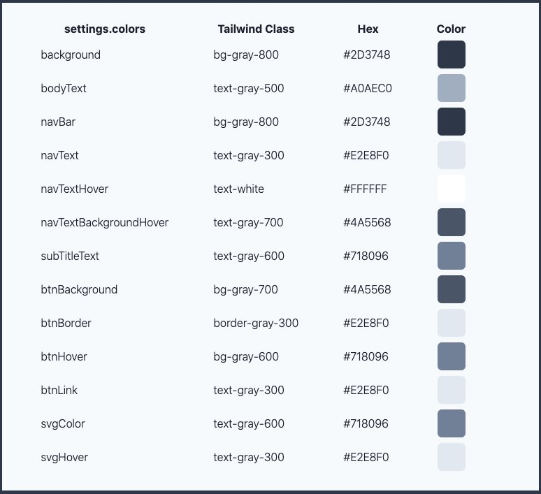
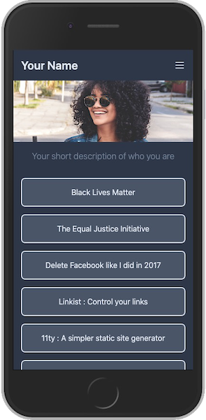
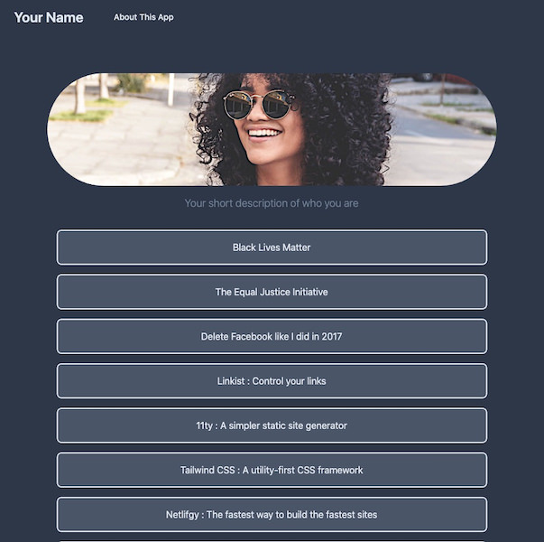

# Linkist

### Updated to TailwindCSS v2.0.2

---

A simple, highly configurable alternative to [Linktr.ee](https://linktr.ee/) and [Linkin.bio](https://later.com/linkinbio/) using only [11ty](https://www.11ty.dev/) and [TailwindCSS](https://tailwindcss.com/).  
_(no webpack, parcel, gulp, etc.)_

> _**NOTE:** This is my first publicly shared and promoted repo. I'm learning while doing and I'm providing the kind of instructions that would be helpful to me while I am/was learning! It's also a great exercise in thinking about the structure, instructions, usage, and how the repo works. I've actually made a LOT of changes to the app while documenting this README._

[Jump down here for screenshots of the default install.](#iphone-screenshots)

   

---

## Table of Contents

- [:boom: Features](#boom-features)
  - [Live Demo!](#live-demo)
- [:wrench: Install and Deploy](#wrench-install-and-deploy)
  - [Standard Install](#standard-install)
  - [Deploy to Netlify](#deploy-to-netlify)
  - [Manage your content with Forestry.io](#manage-your-content-with-forestryio)
- [:unlock: Site Settings](#unlock-site-settings)
- [:link: Managing Links](#link-managing-links)
- [:mega: Managing Social Icons](#mega-managing-social-icons)
- [:small_blue_diamond: Customizing Colors](#small_blue_diamond-customizing-colors)
  - [Default Colors](#default-colors)
  - [Page level color overrides](#page-level-color-overrides)
- [:bar_chart: Google Analytics or Fathom Stats](#bar_chart-google-analytics-or-fathom-stats)
- [:page_with_curl: Adding Pages to the Nav Bar](#page_with_curl-adding-pages-to-the-nav-bar)
- [:iphone: Screenshots](#iphone-screenshots)
- [:page_facing_up: License](#page_facing_up-license)

---

## :boom: Features

- Very simple and basic **11ty** and **TailwindCSS** setup
- No Webpack, Snowpack, Parcel, Gulp, etc. to deal with
- [FontAwesome](https://fontawesome.com/) SVG social icons
  - Includes settings for Dribbble, Facebook, GitHub, Instagram, LinkedIn!, Pinterest, Twitter, YouTube, and Email
- Uses [PurgeCSS](https://github.com/FullHuman/purgecss) and [CSSnano](https://cssnano.co/) resulting in a ~6kb minified CSS file, <2kb gzipped
- `src/_data/settings.json` :
  - Manage your Name and META data
  - Manage your Hero Image and Caption
  - Manage your Social SVG links/icons
  - Manage Color overrides for all colors, including SVGs
- `src/_data/links.json` :
  - Manage your link's URL and display text
- One click deploy to [Netlify](https://www.netlify.com/)
- Pre-configured for use at [Forestry.io](https://forestry.io/) _(if you want to manage Settings and Links in a browser)_

### Live Demo!

**[View the Live Demo of this repo.](https://linkist.netlify.app)**

---

## :wrench: Install and Deploy

Install is standard and easy if you're familiar with [Node.js](https://nodejs.org/).  
If you want to host for free on Netlify, follow the _**Deploy to Netlify**_ instructions below.

### Standard Install

_(assumes you understand and use the terminal to clone and install Node.js apps)_

- Duplicate this repository by clicking <kbd>Use this template</kbd> above
- Clone the repository locally
- Run `npm install` to install dependencies

**Running `dev`, `test`, and `build`:**

- Running `npm run dev` will run in parallel the following:
  - Create the `dist` folder used for production.
  - Process TailwindCSS via PostCSS and watch for changes.
  - Fire up 11ty and use it to `--serve` the site in development mode.
  - You'll need to open a browser and go to <http://localhost:8080> to view the default site and it will automatically reload with any saved changes.
  - **You should see the default app view [shown below](#iphone-screenshots)**
  - To stop the live-server use <kbd>CONTROL c</kbd>
- Running `npm run test` will run the following sequentially:
  - Fire up 11ty to process all files as needed.
  - Process and build the `/dist/assets/css/tailwind.css` file in `NODE_ENV=production` mode to use PurgeCSS to remove unused CSS elements and CSSnano to minify the resulting CSS.
  - Fire up [live-server](https://www.npmjs.com/package/live-server) and automatically open your browser to <http://127.0.0.1:8080/> so you can click around to make sure everything will work when live on the hosting server.
    - _DO NOT make changed while in `test` mode. They will not be automatically updated because neither 11ty nor PostCSS are watching for changes._
  - To stop the live-server use <kbd>CONTROL c</kbd>
- Running `npm run build` will build the site in full **Production** mode as it will sit on the hosting server.

### Deploy to Netlify

To automatically deploy this Template to [Netlify for free hosting](https://www.netlify.com/pricing/), simply click the <kbd>Deploy to netlify</kbd> button below.

- First you'll need a [free Netlify account](https://app.netlify.com/signup).
- And, obviously, a [free GitHub account](https://github.com).
- Clicking the button will copy this repo to your GitHub account.
- It will then connect it to your Netlify account.
- In less than 1-2 minutes, this Template will be up and running live at a unique Netlify domain.
- Go to your GitHub account and find this repo:
  - Clone your new repository locally.
  - Run `npm install` to install dependencies.
  - Follow the instructions above for running `dev`, `test`, and `build`.
  - Any changes you make to your repo, locally and then synced to GitHub, or directly on GitHub will be picked up by Netlify and it will re-deploy your site with the new changes.
  - Follow the instruction at Netlify for setting up your own custom domain...still all free!

### Manage your content with Forestry.io

[Forestry.io](https://forestry.io/) provides an amazing CMS to manage your static site content...[free for personal projects](https://forestry.io/pricing/)!

Install as outlined above and then login or create a free account at Forestry and [follow their instructions for setting up your new site](https://forestry.io/docs/quickstart/setup-site/).

---

## :unlock: Site Settings

Manage all the site settings, Name, Bio, META, stats ID, Image, Social links, and colors in the `src/_data/settings.json` file.  
_Hopefully it's pretty obvious. :smiley:_

---

## :link: Managing Links

Manage all your links in the `src/_data/links.json` file.  
_Hopefully it's pretty obvious. :smiley:_

Add as many, or as few, as you like. I've provided a few that I feel are relevant as of the publish date of this repo.

---

## :mega: Managing Social Icons

We use free [FontAwesome](https://fontawesome.com/) SVGs for the social links at the bottom. According to their license, we provide an attribution link. Please do not remove the link unless you have a Pro FontAwesome account.

Manage all your social links in the `src/_data/settings.json` file.  
_Hopefully it's pretty obvious. :smiley:_

I decided to require the entire URL _(rather than just the profile name)_ in case people wanted to provide links to specific posts, videos, etc.

You can, of course, add any additional platforms by updating the `src/_includes/components/nav.njk` file. If you want to manage your custom SVGs' colors, you'll have to provide the raw SVG code and make sure to add the `class` tag as in the existing platform codes.

---

## :small_blue_diamond: Customizing Colors

This assumes you know/use/understand [TailwindCSS](https://tailwindcss.com/).

You can override the default colors shown below in the `src/_data/settings.json` file.

Tailwind includes a [generous palette of great-looking, well-balanced colors](https://tailwindcss.com/docs/customizing-colors/#default-color-palette) that are perfect for prototyping or for kicking off a brand new project.

If you use the Tailwind classes, make sure to use the proper `bg-[color]-[###]` or `text-[color]-[###]` or `border-[color]-[###]` depending on if it's a **Background**, **Text**, or **Border** color.

### Default Colors

Here are the colors I used in this project.

### Page level color overrides

You can also override some colors at the Page level in the frontmatter.

- Check the [src/about.md](src/about.md) for an example of NO overrides.
- Check the [src/colors.md](src/colors.md) file for an example of ALL the Page color overrides.

_(NOTE: You won't see the `/colors` page in the Nav Bar but you can get to it manually by adding `/colors` to the end of your published URL...or even the [Live Demo](#live-demo). You can delete the [colors.md](src/colors.md) file if you want. It was helpful for creating the Default Colors table.)_

---

## :bar_chart: Google Analytics or Fathom Stats

Personally I don't use or care about stats, but I know some do. I've included conditional code in the `src/_includes/layouts/base.njk` that supports both a Google Analytics tracking code ID and a standard installation [Fathom site ID](https://usefathom.com/support/tracking).

Enter your GA or Fathom IDs _(only)_ in the `/_data/settings.json` file if you want to track site stats.

If you use a different stats provider, you'll have to manually update the `src/_includes/layouts/base.njk` and you can remove the Fathom and GA stats blocks.

---

## :page_with_curl: Adding Pages to the Nav Bar

You can add Pages if you want. The easiest way would be to duplicate the [src/about.md](src/about.md) page and modify it. If you want it to show up in the Nav Bar, be sure to adjust its `title:` and `order:` in the frontmatter.

Your new Page will then automatically show up in both the desktop and mobile Navs.

---

## :iphone: Screenshots

Here's what you should see when you correctly install and run the app locally:

| Mobile                                            | Desktop                                            |
| ------------------------------------------------- | -------------------------------------------------- |
|  |  |

---

## :page_facing_up: License

This project is under the [MIT](LICENSE) license.
Please adhere to the [code of conduct](.github/CODE_OF_CONDUCT.md).
